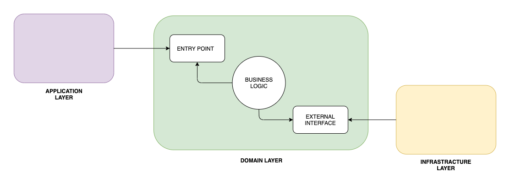

# Hexagonal Architecture
Hexagonal architecture is a model of designing software applications around domain logic to isolate it from external factors.

The domain logic is specified in a business core, which we'll call the inside part, the rest being outside parts. Access to domain logic from the outside is available through ports and adapters.

You can read more on this [page](https://www.baeldung.com/hexagonal-architecture-ddd-spring).